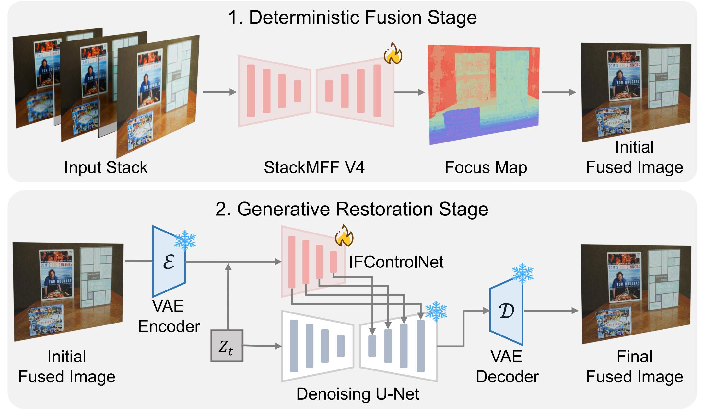

<div align="center">

#  GMFF

**Generative Multi-focus Image Fusion Network**

[](https://opensource.org/licenses/MIT)
[](https://www.python.org/)
[](https://pytorch.org/)
[](https://github.com/Xinzhe99/GMFF)

*Official PyTorch implementation for Generative Multi-focus Image Fusion*

</div>

## 📢 News

> [!NOTE]
> 🎉 **2025.11**: The paper has been submitted.

## Table of Contents

- [Overview](#-overview)
- [Installation](#-installation)
- [Downloads](#-downloads)
- [Usage](#-usage)
- [Evaluation](#-evaluation)
- [Training](#-training)
- [Citation](#-citation)

## 📖 Overview

<div align="center">

</div>


## 🚀 Installation

1. Clone the repository:
```bash
git clone https://github.com/Xinzhe99/GMFF.git
cd GMFF
```

2. Create and activate a virtual environment (recommended):
```bash
conda create -n gmff python=3.10
conda activate gmff
```

3. Install dependencies:
```bash
pip install -r requirements.txt
```

## 📥 Downloads

| Resource | Link | Code | Description |
|----------|------|------|-------------|
| 🗂️ **Test Datasets** | [](https://pan.baidu.com/s/1XrKGlqSK6kc_R-1AzprHlA?pwd=cite) | `cite` | Complete test datasets |
| 📊 **Benchmark Results** | [](https://pan.baidu.com/s/1DMQdAB6AIkjq07Htw4MxfA) | `cite` | Fusion results from all methods |
| 🔧 **Pre-trained Models** | [](https://pan.baidu.com/s/19KNHIfqrV054C-T623P9LA) | `cite` | Pre-trained models |

## 💻 Usage

### Stage 1: Deterministic fusion

The pre-trained StackMFF V4 model weights file (`stackmffv4.pth`) should be placed in the `weights/` directory.

To fuse a stack of multi-focus images, organize your input images in a folder with numeric filenames (e.g., `0.png`, `1.png`, etc.):

```
input_stack/
├── 0.png
├── 1.png
├── 2.png
└── 3.png
```

Run the Stage 1 fusion script:

```bash
python inference_stage1.py --input_dir ./input_stack --output_dir ./results_stage1 --model_path weights/stackmffv4.pth
```

### Stage 2: Generative restoration

The pre-trained model weights files should be placed in the `weights/` directory:
- `IFControlNet.pt`: IFControlNet model weights
- `v2-1_512-ema-pruned.ckpt`: Stable Diffusion v2.1 base model weights

Using the Stage 1 fusion results as input, run the Stage 2 restoration script:

```bash
python inference_stage2.py \
  --upscale 1 \
  --version gmff \
  --sampler spaced \
  --steps 50 \
  --captioner none \
  --pos_prompt '' \
  --neg_prompt 'low quality, blurry, low-resolution, noisy, unsharp, weird textures' \
  --cfg_scale 4 \
  --input ./results_stage1 \
  --output ./results_stage2 \
  --ckpt weights/IFControlNet.pt \
  --device cuda \
  --precision fp32
```

## 📊 Evaluation

### Preparation

Download the benchmark results from the links provided in the [Downloads](#-downloads) section, and put them in the [evaluation](./evaluation) directory.

### Evaluation of StackMFF V4 (Stage 1)

To evaluate the performance of the StackMFF V4 model (Stage 1), you can use the [compare_diff_fusion_methods.py](https://github.com/Xinzhe99/GMFF/blob/main/evaluation/compare_diff_fusion_methods.py) script. This script compares different image fusion methods by calculating SSIM and PSNR metrics with ground truth images.

Example usage:
```bash
python evaluation/compare_diff_fusion_methods.py \
  --base_path evaluation/diff_fusion_methods_results \
  --ground_truth_path "evaluation/diff_fusion_methods_results/Ground Truth" \
  --methods "StackMFF V4" \
  --datasets "Mobile Depth" Middlebury FlyingThings3D Road-MF \
  --output_dir ./evaluation_outputs
```

Outputs should be:

```plaintext
Dataset: Mobile Depth
----------------------------------------
     Method   SSIM    PSNR
StackMFF V4 0.9733 37.2283

Dataset: Middlebury
----------------------------------------
     Method   SSIM    PSNR
StackMFF V4 0.9523 32.3604

Dataset: FlyingThings3D
----------------------------------------
     Method   SSIM    PSNR
StackMFF V4 0.9638 33.7589

Dataset: Road-MF
----------------------------------------
     Method   SSIM    PSNR
StackMFF V4 0.9938 38.8606
```

### Evaluation of GMFF (Stage 2)

To evaluate the performance of the GMFF model (Stage 2), you can use two different evaluation scripts depending on what you want to compare:

1. For comparing different Stage 1 fusion methods followed by GMFF Stage 2, use [compare_stage1_diff_fusion_methods_stage2_gmff.py](https://github.com/Xinzhe99/GMFF/blob/main/evaluation/compare_stage1_diff_fusion_methods_stage2_gmff.py):

Example usage:
```bash
python evaluation/compare_stage1_diff_fusion_methods_stage2_gmff.py \
  --base_path evaluation/stage1_diff_fusion_methods_stage2_gmff \
  --methods "StackMFF V4" \
  --datasets "Mobile Depth" Middlebury \
  --metrics BRISQUE PIQE \
  --output_dir ./evaluation/outputs
```

Outputs should be:

```plaintext
Dataset: Mobile Depth
----------------------------------------
       Method  BRISQUE    PIQE
  StackMFF V4   9.3538 27.6422

Dataset: Middlebury
----------------------------------------
       Method  BRISQUE    PIQE
  StackMFF V4  13.6831 29.1759
```

2. For comparing different restoration methods including GMFF, use [compare_stage1_stackmffv4_stage2_diff_restoration.py](https://github.com/Xinzhe99/GMFF/blob/main/evaluation/compare_stage1_stackmffv4_stage2_diff_restoration.py):

Example usage:
```bash
python evaluation/compare_stage1_stackmffv4_stage2_diff_restoration.py \
  --base_path evaluation/stage1_stackmffv4_stage2_diff_restoration \
  --methods GMFF \
  --datasets "Mobile Depth" Middlebury \
  --metrics BRISQUE PIQE \
  --output_dir ./evaluation/outputs
```

Outputs should be:

```plaintext
Dataset: Mobile Depth
----------------------------------------
  Method  BRISQUE    PIQE
    GMFF   9.3538 27.6422

Dataset: Middlebury
----------------------------------------
  Method  BRISQUE    PIQE
    GMFF  13.6831 29.1759
```

## 🏋️ Training

### Dataset Structure

The GMFF training pipeline consists of two stages:

#### Stage 1 - StackMFF V4 Training:

First, prepare the StackMFF V4 training dataset, the details of which can be found at [step1_make_datasets_for_stackmffv4.py](https://github.com/Xinzhe99/GMFF/blob/main/datasets/step1_make_datasets_for_stackmffv4.py).

The training dataset should be organized in the following structure:

```
gmff_datasets/
├── NYU-V2/
│   ├── TR/ (Training set)
│   │   ├── focus_stack/ (image stacks)
│   │   │   ├── scene1/
│   │   │   │   ├── 0.png
│   │   │   │   ├── 1.png
│   │   │   │   └── 2.png
│   │   │   └── scene2/
│   │   │       ├── 0.png
│   │   │       ├── 1.png
│   │   │       └── 2.png
│   │   └── focus_index_gt/ (Focus index ground truth)
│   │       ├── scene1.npy
│   │       └── scene2.npy
│   └── TE/ (Test/Validation set)
│       ├── focus_stack/
│       └── focus_index_gt/
├── DUTS/
│   ├── TR/
│   └── TE/
└── ...
```

The details of training Stage 1 can be found at https://github.com/Xinzhe99/StackMFF-V3, where you can also find more information about the dataset preparation and training details. StackMFF V4 is an optimization of the network architecture compared to StackMFF V3 and provides improved performance.

#### Stage 2 - GMFF Training:
Second, prepare the GMFF training dataset, the details of which can be found at [step2_make_datasets_for_gmff.py](https://github.com/Xinzhe99/GMFF/blob/main/datasets/step2_make_datasets_for_gmff.py) and [step3_generate_dataset_list_for_gmff.py](https://github.com/Xinzhe99/GMFF/blob/main/datasets/step3_generate_dataset_list_for_gmff.py), note that the GMFF training dataset is generated from the StackMFF V4 fusion results.

The training dataset should be organized in the following structure:

```
gmff_datasets/
├── NYU-V2/
│   ├── TR/ (Training set)
│   │   ├── focus_stack/ (image stacks)
│   │   ├── AiF/ (All-in-Focus ground truth)
│   │   └── AiF_missing/ (Stage 1 fusion results)
│   └── TE/ (Test/Validation set)
│       ├── focus_stack/
│       ├── AiF/
│       └── AiF_missing/
├── DUTS/
│   ├── TR/
│   └── TE/
└── ...
```

### Training Stage 1

To train the StackMFF V4 model (Stage 1), run the following command:

```bash
python train_stage1.py \
  --save_name train_stackmffv4 \
  --datasets_root /path/to/stackmff_datasets \
  --train_datasets NYU-V2 DUTS DIODE Cityscapes ADE \
  --val_datasets NYU-V2 DUTS DIODE Cityscapes ADE \
  --batch_size 12 \
  --num_epochs 50 \
  --lr 1e-3 \
  --subset_fraction_train 0.1 \
  --subset_fraction_val 0.02 \
  --gpu_ids 0
```

### Training Stage 2

To train the GMFF model (Stage 2), run the following command:

```bash
accelerate launch train_stage2.py --config configs/train/train_stage2.yaml
```

## 📚 Citation

If you find this work useful, please consider citing our paper:

```bibtex
@article{gmff2025,
  title={Generative Multi-focus Image Fusion},
  author={Xie, Xinzhe and Others},
  journal={arXiv preprint arXiv:XXXX.XXXXX},
  year={2025}
}
```

## 🙏 Acknowledgments

This codebase is built upon several excellent open-source projects:
- [DiffBIR](https://github.com/XPixelGroup/DiffBIR)
- [ControlNet](https://github.com/lllyasviel/ControlNet)
- [Stable Diffusion](https://github.com/Stability-AI/StableDiffusion)
<div align="center">

⭐ If you find this project helpful, please give it a star and cite our paper!

</div>
